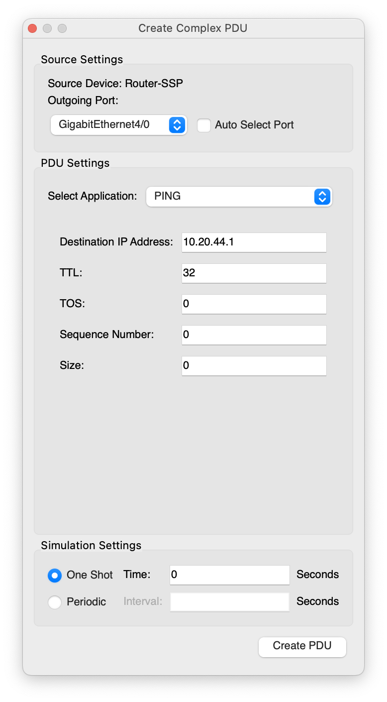
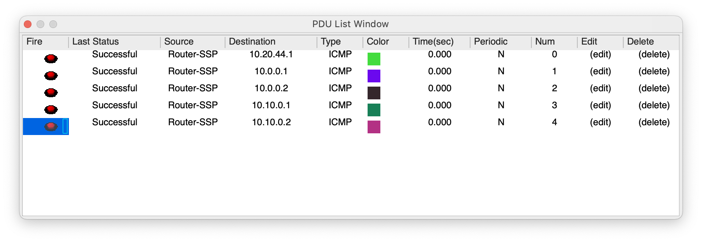

# Punto 1

Il primo punto della prima parte chiede quanto segue:

```text
1. sviluppi una descrizione di massima, anche supportata da uno schema grafico,
dell’infrastruttura di rete in fibra pre-esistente (che connette Enti locali, scuole e strutture
sanitarie pubbliche) e di come questa si evolverà per implementare il nuovo servizio per le
strutture sanitarie private convenzionate, con opportune esemplificazioni degli indirizzamenti
IP adottati;
```

In questa soluzione affrontiamo in particolare dettaglio lo studio della rete pre-esistente, per esercizio. Durante il compito, sarà possibile anche essere un po' più superficiali ed affrontare più in dettaglio l'evoluzione della nuova rete.

## Piano di indirizzamento

Usando un approccio **top-down**, partiamo dalla nostra rete di base e dividiamo in macro subnet, in base alle nostre esigenze.

Le subnet che ci servono sono:

- Enti locali
- Scuole
- Strutture sanitarie pubbliche (SSPub)
- Data Center

A queste, dobbiamo aggiungere una subnet per tutti i router di aggregazione e core della rete regionale (vedremo dopo il suo uso in dettaglio).

La rete di partenza è data dal testo ed è `10.0.0.0\8`.

Quanti bit dedichiamo ad ognuna delle categorie sopra? Prendendo ispirazione dalla rete suggerita dal testo per le strutture private, per semplicità possiamo provare ad assegnare a tutte le categorie un `/16`.

| Nome             | Indirizzo     |
|------------------|---------------|
| Core/Aggregation | 10.0.0.0/16   |
| Data Center      | 10.10.0.0/16  |
| SS Pub           | 10.20.0.0/16  |
| Scuole           | 10.30.0.0/16  |
| Enti Locali      | 10.40.0.0/16  |
| SS Privato       | 10.100.0.0/16 |

Ora per ogni categoria dobbiamo calcolare quanti bit servono per la singola struttura, in base alla stima fatta precedentemente. Vediamo come fare.

- Data center: il data center al momento è uno solo ma possiamo ipotizzare che ce ne potrebbero essere altri, ma in numero comunque ridotto; per semplicità, possiamo assegnare ad ogni singolo data-center un `/24`, per mantenere un subnetting semplice
- SS Pub: ne abbiamo ipotizzati 100, quindi anche in questo caso per semplicità posso ipotizzare un `/24`, perché tra `/16` della precedente e `/24` ci sono 8 bit, che mi danno la possibilità di 256 reti, ci rientro abbondantemente; inoltre ogni rete avrebbe 8 bit per gli host, quindi `256-2=254` hosts, che consideriamo sufficienti, anche considerando che il testo ci dice che le strutture private ne devono avere almeno 8
- Scuole: ne abbiamo ipotizzate 1000, qui dobbiamo fare un po' di calcoli. Nel dettaglio, i passi da seguire sono:

1. calcolo la potenza di 2 più vicina al numero di subnet che devo creare, in questo caso 1000 -> **1024**
2. trovo l'esponente della potenza di 2, in questo caso  `1024=2^10` -> 10 bits
3. calcolo la netmask in slash notation, a partire da quella precedente, quindi partendo da `/16`, ottengo `16+10=26` -> `/26`
4. a questo punto posso calcolare quanti host avrei per struttura: se 26 bit sono bloccati dalla maschera di rete, mi rimangono `32-26=6` bits liberi per gli host, quindi `2^6=64` indirizzi IP, a cui tolgo due indirizzi per rete e broadcast, ottenendo 62 indirizzi per ogni scuola. Anche qui, ritengo il numero accettabile e confermo la maschera `/26`.

- Enti Locali: ne abbiamo stimati circa 300, ripetendo il calcolo di prima ottengo un `/25` con 126 host disponibili, anche in questo caso ritengo le stime accettabili

- SS Private: sono circa 2000, ripetiamo nel dettaglio il calcolo:

1. calcolo la potenza di 2 più vicina al numero di subnet che devo creare, in questo caso 2000 -> **2048**
2. trovo l'esponente della potenza di 2, in questo caso  `2048=2^11` -> 11 bits
3. calcolo la netmask in slash notation, a partire da quella precedente, quindi partendo da `/16`, ottengo `16+11=27` -> `/27`
4. a questo punto posso calcolare quanti host avrei per struttura: `32-27=5` bits liberi per gli host, quindi `2^5=32` indirizzi IP, a cui tolgo due indirizzi per rete e broadcast, ottenendo 30 indirizzi per ogni struttura.

Possiamo notare che abbiamo molti più hosts per struttura di quanti richiesti dal testo (30 rispetto ad 8), mentre siamo abbastanza stretti nel numero di strutture che possiamo supportare, in quanto il massimo è 2048, ma il testo ci chiedeva di prevedere incrementi futuri. Ci conviene quindi usare un bit in più per le reti, passando da `/27` a `/28`, in modo da supportare fino a 4096 strutture, togliendolo dagli host, quindi `2^4=16` IP -> 14 hosts, che sono comunque accettabili.

Nota: avremmo anche potuto usare un approccio _bottom-up_, partendo dal numero di host e calcolando la subnet della struttura. In questo caso il procedimento è inverso al precedente, come segue:

1. calcolo la potenza di 2 più vicina al numero di host che devo supportare; in questo caso, siccome il testo dice "un minimo" di 8 indirizzi complessivi, possiamo considerarne 16 per sicurezza
2. calcolo il numero di bit dedicato agli host: `16=2^4` -> 4 bits
3. calcolo la netmask in slash notation, a partire dal numero totale di bits, da cui ho che la rete della singola struttura è `32-4 = 28`, ovvero ogni struttura ha un `/28`
4. verifico se ho un numero adeguato di subnets: da `/16` a `/28` ci sono 12 bits, quindi `2^12=4096` che sono sufficienti per le strutture che devo supportare

Come vedete, in entrambi gli approcci ottengo il medesimo risultato.

Il piano di indirizzamento è quindi:

| Nome             | Indirizzo     | Singola struttura     |
|------------------|---------------|---------------|
| Core/Aggregation | 10.0.0.0/16   | /24 |
| Data Center      | 10.10.0.0/16  | /24 |
| SS Pub           | 10.20.0.0/16  | /24 |
| Scuole           | 10.30.0.0/16  | /26 |
| Enti Locali      | 10.40.0.0/16  | /25 |
| SS Privato       | 10.100.0.0/16 | /28 |

Il testo dell'esame chiede esplicitamente "opportune esemplificazioni degli indirizzamenti
IP adottati", quindi seguiamo questa direttiva ed elenchiamo le prime quattro reti del SS Privato. Ricordiamo che ogni rete ha 16 indirizzi IP (`2^4`).

Rete di partenza: **10.100.0.0/28**

| Nome             | Indirizzo rete     | Primo host     |Primo host     |Broadcast|
|------------------|---------------|---------------|---|---|
| SSPriv-1 | 10.100.0.0/28  | 10.100.0.1 |10.100.0.14 |10.100.0.15|
| SSPriv-2 | 10.100.0.16/28  | 10.100.0.17 |10.100.0.30 |10.100.0.31|
| SSPriv-3 | 10.100.0.32/28  | 10.100.0.33 |10.100.0.46 |10.100.0.47|
| SSPriv-4 | 10.100.0.48/28  | 10.100.0.49 |10.100.0.62 |10.100.0.63|

## Schema grafico

Qui useremo CISCO Packet Tracer per i diagrammi di rete, all'esame consiglio di usare un'impostazione grafica molto simile, usando simboli simili e soprattutto annotazioni simili per le reti e gli indirizzi delle porte.

### Situazione pre-esistente

In questo compito, immagino che la Regione acquisti ed installi dei router propri per la comunicazione tra le strutture. In questo scenario, non devo usare VPN o tunnel per far comunicare in sicurezza tra loro gli host, ma posso basarmi solo sui livelli della pila ISO/OSI di rete e trasporto. Potrebbe non essere la soluzione più verosimile, ma è comunque compatibile con il testo, in quanto nel primo paragrafo esplicita chiaramente che _"L’amministrazione di una Regione italiana [...] ha recentemente sviluppato una infrastruttura di comunicazione in fibra ottica"_.

#### Topologia rete regionale

Parto impostando i router della rete regionali, ricordandomi di annotare scrupolosamente l'indirizzo base di ogni link e gli indirizzi per ogni porta del router, come nell'immagine che segue.


Come si può vedere dall'immagine, consiglio di specificare esattamente il nome dell'ospedale e della scuola, ispirandovi ad esempi di vostra conoscenza, come in questo caso: ho messo la nostra scuola come esempio di scuola, e l'ospedale S.Paolo di Civitavecchia come esempio di ospedale. Entrambi sono collegati al router-ISP di Civitavecchia. Il data-center è invece collegato all'ipotetico router di Roma-4. Non ho messo per semplicità gli enti locali, perché sono funzionalmente esattamente identici alle scuole.

Come indirizzi base, per la scuola e l'ospedale non ho messo il primo indirizzo disponibile della rete, ma uno qualsiasi all'interno del loro range.

#### Routing rete regionale

Ora devo occuparmi di come i routers si scambiano i pacchetti fra di loro, impostando le tabelle di routing.

Uso due approcci diversi per la comunicazione tra i router perimetrali delle strutture con il proprio ISP, ed i router della core/aggregation network.

Per la comunicazione tra i router perimetrali con il proprio ISP, ha senso avere una rotta statica sul router perimetrale in cui inoltro tutto il traffico proveniente dalla struttura verso l'ISP, in quanto in effetti è proprio il comportamento atteso. Lo svantaggio di avere una rotta statica è che, se cambio ISP, devo cambiare anche manualmente la rotta, ma questo è ragionevole, in quanto l'evento è piuttosto raro e comunque se cambio ISP dovrò sicuramente cambiare qualche impostazione del mio router. Imposto quindi la rotta statica su tutti i router perimetrali come segue.


Per quanto riguarda i router interni, invece, non è ragionevole impostare le rotte tra loro staticamente, perché nella realtà potrebbero essere centinaia (non solo Civitavecchia e Roma-4), e cambiare con una certa frequenza. Devo quindi usare il routing dinamico, ed il più comune in questo ambito è l'[OSPF](https://it.wikipedia.org/wiki/Open_Shortest_Path_First). Per il routing OSPF, bisogna assegnare le porte di ogni router ad _aree_, che possono essere di diverse tipologie (_stub_, _backbone_, _standard_, etc.). Per semplicità, qui useremo un'unica area, a cui assegneremo l'ID 20.


Per configurare su Packet Tracer il routing OSPF, posso usare i seguenti comandi:

```text
! Abilito OSPF e gli assegno come process ID il valore 100 (interno al router)
Router(config)# router ospf 100
! Assegno il router-id che deve essere **unico** per ogni router all'interno di OSPF
Router(config-router)#  router-id 1.1.1.1
Router(config-router)# exit
! Ripetere la seguente configurazione per tutte le interfacce del router
Router(config)# interface ga 0/0
Router(config-if)# ip ospf 100 area 20
Router(config-if)# exit
```

A questo punto, su PT controllo che tutte le tabelle siano configurate correttamente usando la lente di ingrandimento e selezionando Routing Tables.

I routers perimetrali dovranno avere una tabella di questo genere, con una rete direttamente connessa (C) ed una rotta statica di default (S):


I router interni dovranno avere una tabella di routing di questo genere, con 2 o più reti direttamente connesse ed una o più reti conosciute tramite OSPD (O):


Ora dobbiamo controllare se tutto sta andando bene, provando a fare dei ping. Quando facciamo ping dai routers, conviene usare la funzionalità "Add complex PDU" di PT, selezionando la busta da lettere aperta nella barra in alto. Dopo averla selezionata, cliccare sul router di partenza del ping e completare le impostazioni come necessario.



Ricordarsi di selezionare la "Outgoing port" come desiderato, ed impostare Sequence Number e Time a 0.

Nel mio caso, partendo dal router dell'ospedale ho provato ad allontanarmi pian piano fino ad arrivare al router del data center, controllando che ogni volta il ping con tutte le interfacce sia corretto.



Ricordatevi di pingare tutte le interfacce che attraversate: nei router intermedi, dovete quindi provare a pingare sia l'interfaccia interna che esterna. Ricordatevi anche che i primi ping potrebbero fallire, quindi "sparateli" più volte per sicurezza se falliscono (tasto "Fire").

#### Reti interne delle strutture

Per le reti interni pre-esistenti, semplificheremo al massimo la topologia, usando un singolo computer per l'ospedale ed la scuola ed un singolo server per il data center. Questi ci serviranno anche in futuro per testare se i requisiti di autenticazione sono rispettati.

Le reti interne delle strutture avranno degli indirizzi IP privati scelti dalla singola struttura. Per semplicità, useremo esempi di indirizzi privati di classe B e C, non di classe A, per non confondersi con la rete regionale. In ogni caso, quanto esposto di seguito andrebbe bene anche se internamente una struttura avesse degli indirizzi privati di classe A.

In questo contesto semplificato, immaginiamo che ospedali e scuole non abbiano dei server interni da esporre, quindi abbiano solo NAT dinamico, per permettere a tutti i computer interni di comunicare con l'esterno. Il data center invece avrà solo NAT statici per esporre i propri server. Nella realtà, è molto probabile che le strutture abbiano una combinazione di NAT statico e dinamico in base alle esigenze. Sempre per esigenze di semplificazione, non implementeremo PAT in packet tracer.

Cominciamo con il con NAT statico del data center.

```text
! Configure inside interface
interface GigabitEthernet5/0
 ip nat inside

! Configure outside interface
interface GigabitEthernet4/0
 ip nat outside

! Configure static NAT
ip nat inside source static 192.168.0.2 10.10.0.10

! Configure access list to allow web traffic
access-list 101 permit tcp any host 10.10.0.10 eq 80
access-list 101 permit tcp any host 10.10.0.10 eq 443

! Apply access list to outside interface
interface GigabitEthernet4/0
 ip access-group 101 in
```

Ora configuriamo il NAT dinamico dell'ospedale.

```text
! Configure inside interface
interface GigabitEthernet5/0
 ip nat inside

! Configure outside interface
interface GigabitEthernet4/0
 ip nat outside

! Define the pool of public IP addresses
ip nat pool PUBLIC_POOL 10.20.44.10 10.20.44.20 netmask 255.255.255.0

! Create an access list to define which private IPs can be translated
access-list 1 permit 172.16.0.0 0.0.255.255

! Configure dynamic NAT
ip nat inside source list 1 pool PUBLIC_POOL
```
